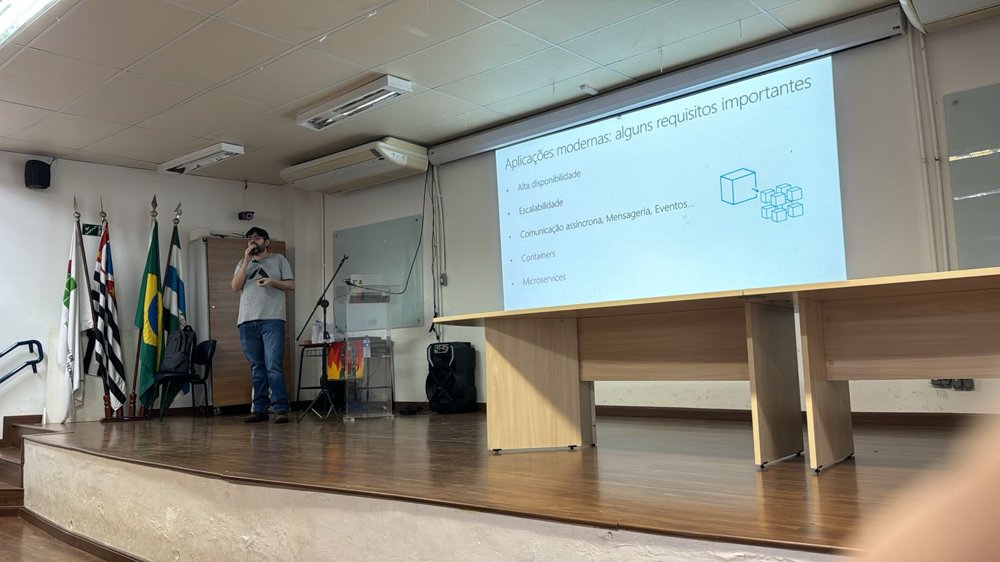
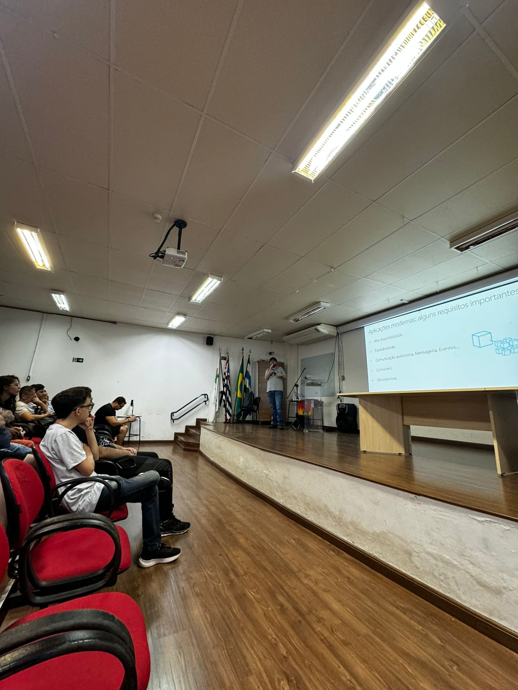
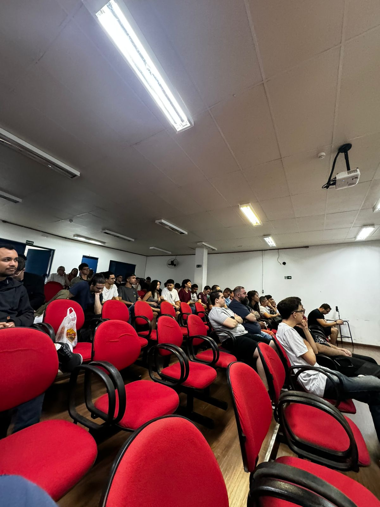
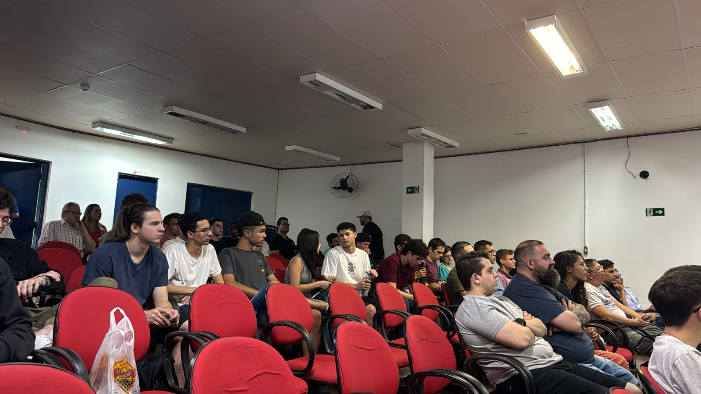
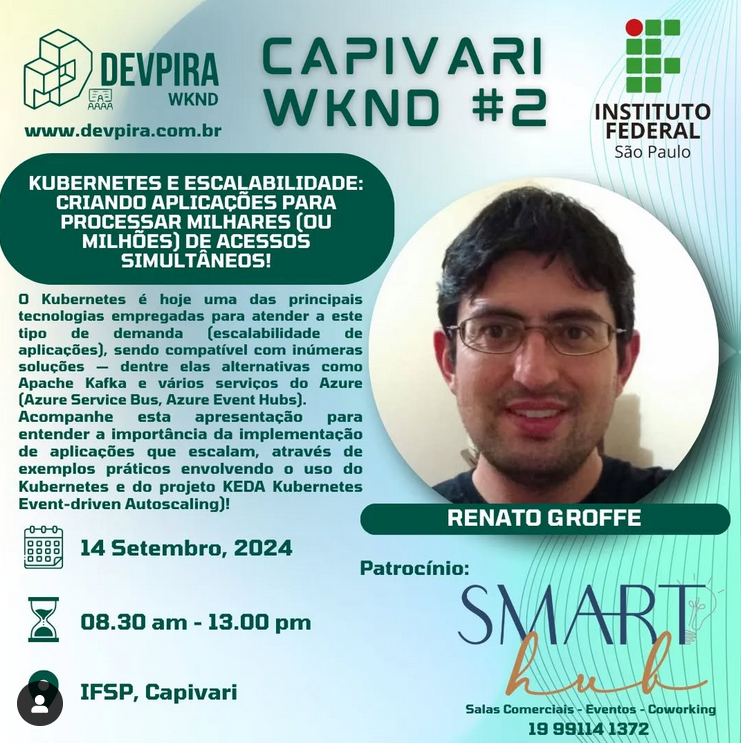
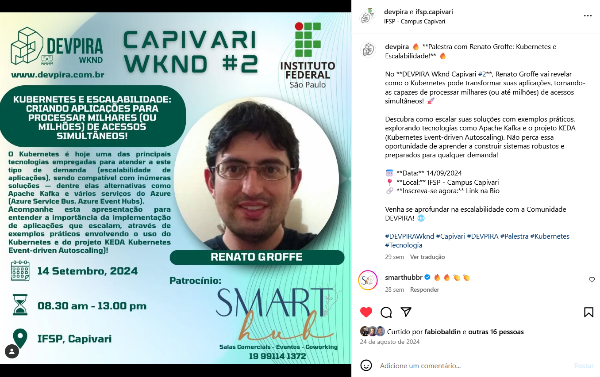

# Kubernetes_DevPiraWkndCapivari-2024-09
Materiais de apresentação sobre Kubernetes realizada no dia 14/09/2024.

---

Título da apresentação: **Kubernetes e Escalabilidade - Criando aplicações para processar milhares (ou milhões) de acessos simultâneos!**

Data: **14/09/2024 (sábado)**

Tecnologias e tópicos abordados: **Kubernetes, Azure Kubernetes Service, Docker, Docker Hub, KEDA, KEDA Cron Scaler, Helm, Linux, Microservices, DevOps, DevSecOps, .NET, ASP.NET Core, Go...**

Número de participantes: **72 pessoas**

Local: **Instituto Federal de Educação, Ciência e Tecnologia de São Paulo - Campus Capivari - Avenida Dr. Ênio Pires de Camargo, 2971 - Ribeirão - Capivari-SP - CEP: 13365-010**

Av. Dr. Ênio Pires de Camargo, 2971 - Ribeirão, Capivari - SP, 13365-010

Deixo aqui meus agradecimentos ao **Alexandre Ballestero**, ao **Fábio Baldin**, ao **Murilo Beltrame**, ao **Matheus Barros** e demais organizadores por todo o apoio para que eu partipasse como palestrante de mais um evento promovido pela comunidade **DEVPIRA**.

---

Outras fotos podem ser encontrados neste [**diretório**](/img/).